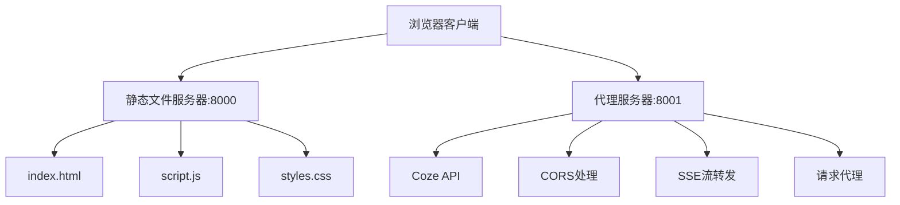

# Coze工作流调用器

一个基于Web的Coze工作流调用工具，支持通过友好的用户界面调用Coze API，并提供实时流式响应展示。

## 🌟 功能特性

- **🎨 现代化UI设计**：采用渐变背景和粒子动效，提供优雅的用户体验
- **🔄 实时流式处理**：支持SSE（Server-Sent Events）流式响应，实时显示处理进度
- **🌐 CORS解决方案**：内置代理服务器，完美解决浏览器跨域限制
- **📱 响应式设计**：适配各种屏幕尺寸，支持移动端访问
- **🔒 安全认证**：支持API Token身份验证
- **📋 一键复制**：处理结果支持一键复制到剪贴板
- **🎯 调试支持**：提供调试链接，方便问题排查

## 🏗️ 项目结构

```
6000_Trae_Coze/
├── index.html          # 主页面
├── manual.html         # 操作手册
├── script.js           # 前端JavaScript逻辑
├── styles.css          # 样式文件
├── proxy_server.py     # Python代理服务器
├── docs/               # 项目文档
│   └── coze-workflow-frontend/
│       ├── ALIGNMENT_*.md
│       ├── CONSENSUS_*.md
│       ├── DESIGN_*.md
│       ├── TASK_*.md
│       ├── ACCEPTANCE_*.md
│       ├── FINAL_*.md
│       └── TODO_*.md
└── README.md           # 项目说明文档
```

## 🚀 快速开始

### 环境要求

- Python 3.7+
- 现代浏览器（支持ES6+）
- 有效的Coze API Token

### 安装依赖

```bash
# 安装Python依赖
pip install aiohttp
```

### 启动服务

1. **启动代理服务器**（端口8001）：
```bash
python proxy_server.py
```

2. **启动静态文件服务器**（端口8000）：
```bash
python -m http.server 8000
```

3. **访问应用**：
   - 主应用：http://localhost:8000
   - 操作手册：http://localhost:8000/manual.html
   - 代理健康检查：http://localhost:8001/health

## 📖 使用说明

### 基本使用流程

1. **填写必要参数**：
   - **输入内容**：要处理的文本内容
   - **飞书链接**：（可选）飞书文档链接
   - **工作流ID**：从Coze工作流详情页获取
   - **API Token**：您的Coze API访问令牌
   - **数量**：处理数量（1-10）

2. **执行工作流**：
   - 点击"执行工作流"按钮
   - 系统会实时显示处理进度
   - 等待执行完成

3. **查看结果**：
   - 处理结果会在页面下方展示
   - 可点击"复制结果"按钮复制到剪贴板
   - 如有调试链接，可点击查看详细信息

### 参数说明

| 参数 | 必填 | 说明 |
|------|------|------|
| 输入内容 | ✅ | 要处理的主要文本内容 |
| 飞书链接 | ❌ | 飞书文档的分享链接，格式如：https://vqt9c12lrhq.feishu.cn/base/... |
| 工作流ID | ✅ | Coze平台的工作流标识符，如：7538098194430640164 |
| API Token | ✅ | Coze API的访问令牌，用于身份验证 |
| 数量 | ✅ | 处理的数量，范围1-10，默认为2 |

## 🔧 技术架构

### 前端技术栈
- **HTML5 + CSS3**：现代化页面结构和样式
- **原生JavaScript**：无框架依赖，轻量级实现
- **Canvas动画**：粒子背景效果和成功庆祝动画
- **SSE客户端**：实时接收服务器推送事件

### 后端技术栈
- **Python 3.7+**：服务器端语言
- **aiohttp**：异步HTTP客户端/服务器框架
- **代理模式**：解决CORS跨域问题
- **流式处理**：支持SSE实时数据传输

### 架构设计



## 🛠️ 开发指南

### 本地开发

1. **克隆项目**：
```bash
git clone <repository-url>
cd 6000_Trae_Coze
```

2. **安装依赖**：
```bash
pip install aiohttp
```

3. **启动开发环境**：
```bash
# 终端1：启动代理服务器
python proxy_server.py

# 终端2：启动静态文件服务器
python -m http.server 8000
```

### 代码结构说明

- **index.html**：主页面，包含表单和结果展示区域
- **script.js**：核心JavaScript逻辑，处理用户交互和API调用
- **styles.css**：样式定义，包含响应式设计和动画效果
- **proxy_server.py**：代理服务器，处理CORS和SSE流转发

### 自定义配置

可以通过修改以下文件进行自定义：

- **端口配置**：修改`proxy_server.py`中的端口设置
- **样式主题**：修改`styles.css`中的颜色和布局
- **API端点**：修改`script.js`中的API URL配置

## 🔍 故障排除

### 常见问题

1. **连接错误**：
   - 确保代理服务器（端口8001）正在运行
   - 检查防火墙设置是否阻止了本地端口访问

2. **API调用失败**：
   - 验证API Token是否有效
   - 确认工作流ID是否正确
   - 检查网络连接是否正常

3. **页面无法加载**：
   - 确保静态文件服务器（端口8000）正在运行
   - 检查浏览器控制台是否有错误信息

### 调试方法

1. **查看服务器日志**：
   - 代理服务器会输出详细的请求日志
   - 浏览器开发者工具查看网络请求

2. **健康检查**：
   - 访问 http://localhost:8001/health 检查代理服务器状态
   - 检查浏览器控制台的错误信息

## 📝 更新日志

### v1.0.0
- ✨ 初始版本发布
- 🎨 现代化UI设计
- 🔄 SSE流式处理支持
- 🌐 CORS代理解决方案
- 📱 响应式设计

## 🤝 贡献指南

欢迎提交Issue和Pull Request来改进这个项目！

1. Fork 项目
2. 创建特性分支 (`git checkout -b feature/AmazingFeature`)
3. 提交更改 (`git commit -m 'Add some AmazingFeature'`)
4. 推送到分支 (`git push origin feature/AmazingFeature`)
5. 开启 Pull Request

## 📄 许可证

本项目采用 MIT 许可证 - 查看 [LICENSE](LICENSE) 文件了解详情。

## 👨‍💻 作者信息

- **作者**：风沙
- **微信**：Love_Gws_1314
- **项目地址**：[GitHub Repository]

## 🙏 致谢

感谢以下技术和工具的支持：
- [Coze API](https://www.coze.cn/) - 强大的AI工作流平台
- [aiohttp](https://aiohttp.readthedocs.io/) - 异步HTTP框架
- [MDN Web Docs](https://developer.mozilla.org/) - Web技术文档

---

如有问题或建议，欢迎通过Issue或微信联系！