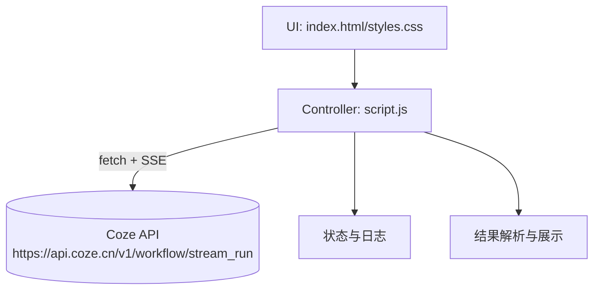
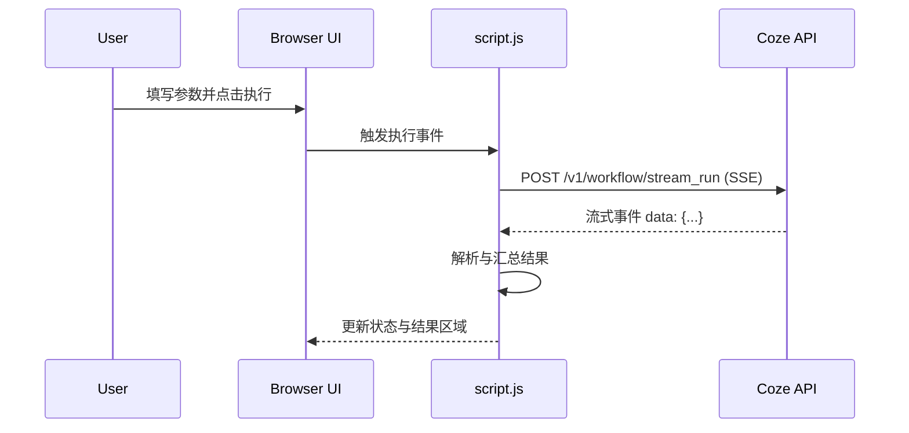

# DESIGN — Coze 工作流前端调用器（coze-workflow-frontend）

## 1. 整体架构（Mermaid）


## 2. 分层与核心组件
- UI 层（HTML/CSS）：
  - 表单区：输入、Feishu 链接、Workflow ID、Token、数量
  - 按钮区：执行按钮（带加载态）
  - 结果区：处理结果、Feishu 链接、调试链接、执行信息
  - 作者信息展示
- 控制层（JS）：
  - 参数校验与整形（clamp、空值判断）
  - 调用器：封装 fetch + ReadableStream，Accept: text/event-stream
  - SSE 解析器：基于行缓冲与事件边界解析，宽容 JSON 解析
  - 状态管理：状态文案、按钮 loading 态切换
  - 结果汇总：选择“结束/包含 output/data/content”作为最终结果

## 3. 接口契约
- POST https://api.coze.cn/v1/workflow/stream_run
- Headers：
  - Authorization: Bearer <token>
  - Content-Type: application/json
  - Accept: text/event-stream, application/json;q=0.9, */*;q=0.8
- Body：
```
{
  "workflow_id": "7538098194430640164",
  "parameters": {
    "input": "...",
    "NUM": 2,
    "feishu_token": "..." // 可选
  }
}
```

## 4. 数据流向图


## 5. 异常处理策略
- 认证错误/参数错误：从响应状态码与 body 中提取信息并提示。
- SSE 解析异常：不中断，尽量忽略异常片段并继续解析。
- 网络错误：提示重试，按钮状态恢复。

## 6. 实施计划
- 校验与微调现有脚本中的 API 域名与路径为 https://api.coze.cn/v1/workflow/stream_run。
- 自测：填入有效 token 与 workflow_id，观察流式状态与结果。
- 若出现 CORS/SSE 受限，再追加“代理方案”设计文档。
