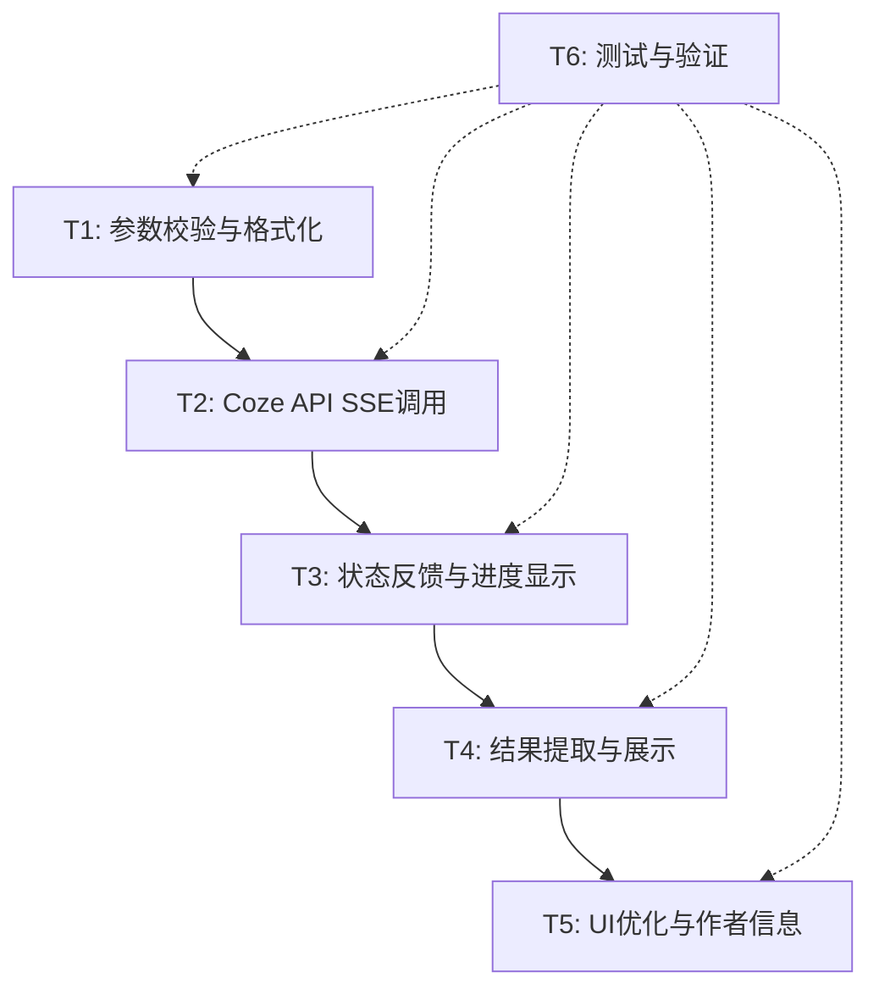

# TASK: Coze工作流前端调用器子任务拆分

> 基于 DESIGN 文档将项目拆分为可独立验证的原子任务

## 项目依赖图

## 子任务清单

### T1: 参数校验与格式化
**输入契约**：
- 现有 HTML 输入表单（5个字段）
- 现有脚本基础结构

**输出契约**：
- 完善的参数校验逻辑（token、workflow_id、input必填）
- 规范的 payload 构造（符合 Coze API）
- 数量范围限制（1~10）

**实现约束**：
- 直接修改现有 script.js
- 保持错误提示友好性
- 使用现有 UI 状态更新函数

**验收标准**：
- [ ] 必填字段空值时显示明确错误信息
- [ ] NUM字段自动范围限制为1~10
- [ ] payload格式与用户样例一致
- [ ] 可选字段（feishu_token）空值时不包含在参数中

### T2: Coze API SSE调用
**输入契约**：
- 验证通过的参数对象
- 现有 streamSSE 函数

**输出契约**：
- 调用 https://api.coze.cn/v1/workflow/stream_run <mcreference link="https://www.coze.cn/docs/developer_guides/api_overview" index="2">2</mcreference>
- 正确的请求头（Bearer认证、Content-Type）
- SSE流事件解析

**实现约束**：
- 复用现有 streamSSE 实现
- 添加适当的错误处理
- 保持与现有代码风格一致

**验收标准**：
- [ ] 请求头包含正确的Authorization Bearer
- [ ] Content-Type为application/json
- [ ] Accept头支持text/event-stream
- [ ] 错误响应时显示有意义的错误信息

### T3: 状态反馈与进度显示
**输入契约**：
- SSE事件流
- 现有状态显示组件

**输出契约**：
- 实时进度反馈
- 加载状态视觉提示
- 完成/错误状态区分

**实现约束**：
- 使用现有 setStatus 函数
- 使用现有按钮loading样式
- 保持状态更新的即时性

**验收标准**：
- [ ] 点击按钮后立即显示"正在调用"状态
- [ ] SSE事件接收时显示进度信息
- [ ] 完成时显示"执行成功"或具体错误
- [ ] 按钮loading动画正常工作

### T4: 结果提取与展示
**输入契约**：
- SSE流最终结果
- 现有结果展示区域

**输出契约**：
- 从复杂响应中提取核心信息
- 格式化展示（message、feishu_url、debug_url）
- 复制功能可用

**实现约束**：
- 使用现有 renderResult 函数
- 兼容多种响应格式
- 保持UI展示的友好性

**验收标准**：
- [ ] 成功提取workflow结果中的主要内容
- [ ] feishu链接可点击跳转
- [ ] debug链接可点击跳转
- [ ] 复制按钮可以复制完整结果
- [ ] 无结果时显示合理的提示

### T5: UI优化与作者信息
**输入契约**：
- 现有页面布局和样式
- 作者信息要求

**输出契约**：
- 显示作者信息："风沙 | 微信：Love_Gws_1314"
- 保持页面炫酷视觉效果
- 布局合理性优化

**实现约束**：
- 作者信息需突出显示
- 保持现有粒子背景和渐变效果
- 不破坏现有响应式布局

**验收标准**：
- [ ] 作者信息位置醒目且美观
- [ ] 整体视觉风格保持一致
- [ ] 在不同屏幕尺寸下显示正常
- [ ] 所有交互效果正常工作

### T6: 测试与验证
**输入契约**：
- 完成的功能模块
- 有效的测试token和workflow_id

**输出契约**：
- 完整功能验证
- 边界情况测试
- 兼容性确认

**实现约束**：
- 使用真实Coze API进行测试
- 覆盖正常和异常流程
- 确保浏览器兼容性

**验收标准**：
- [ ] 能成功调用Coze工作流并返回结果
- [ ] 参数校验覆盖所有边界情况
- [ ] 网络异常时错误处理得当
- [ ] 在主流浏览器中均能正常工作
- [ ] SSE连接断开时有合理提示

## 实施顺序
1. **T1** → 确保参数处理正确
2. **T2** → 建立API调用能力  
3. **T3** → 添加状态反馈
4. **T4** → 完善结果展示
5. **T5** → 优化UI和作者信息
6. **T6** → 全面测试验证

## 质量检查点
- 每个任务完成后立即进行功能验证
- 确保不破坏现有功能
- 保持代码简洁和可维护性
- 所有用户交互都有合适的反馈